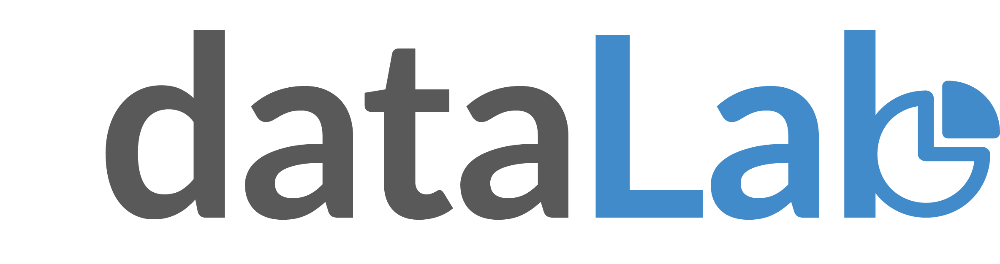

# dataLab
dataLab is a desktop application that enables businesses to stay informed of critical performance metrics through shareable dashboards of live-updating D3 visualizations sourced from their local databases.

The desktop application was created using Electron. Auth0 was used to handle user authentication, which also allows social authentication through Facebook, Google, or any other OAuth provider. Users can slice data from their local databases using SQL commands, and then create real-time updating D3 graphs.

The Explorer page is home to the D3 chart creation tools. A control panel allows non-D3 users to make charts, but advanced D3 users can modify the D3 code directly. Once a chart is created, multiple charts can be combined onto a dashboard and charts are updated in real-time as databases are updated. We used Firebase to keep track of all user accounts.

The application was made during a 2.5 week project as part of Fullstack Academy's Software Engineering Program.

TECHNOLOGIES: React, Redux, Electron, JavaScript, SQL, HTML, CSS, D3, Firebase, Auth0.

## Installation
First, clone the repository through git and change to the new directory:
```
git clone https://github.com/dataLabApp/dataLabApp.git
cd dataLabApp
```
Then install the required dependencies:
```
npm install
```
Run the app:
```
npm start
```

## Screenshots & Gifs
### Real-time Updating Dashboards


### Beautiful D3 Visualizations


### Query and Slice Data from Local Databases


### Create D3 Visualizations from Local Databases


### Edit D3 Code Directly for Advanced D3 Users


### User Accounts Maintained with Auth0 and Firebase


### Export D3 Visualization as SVG Object or PDF


### Share Visualizations


## Contributors
* [Andrew Hookom](https://www.linkedin.com/in/ahookom/)
* [Bruce Grugett](https://www.linkedin.com/in/bruce-grugett/)
* [Mandi Meidlinger](https://www.linkedin.com/in/mandi-meidlinger/)
* [Sara Al Mughairy](https://www.linkedin.com/in/sawra/)

## License
MIT © Andrew Hookom, Bruce Grugett, Mandi Meidlinger, Sara Al Mughairy
